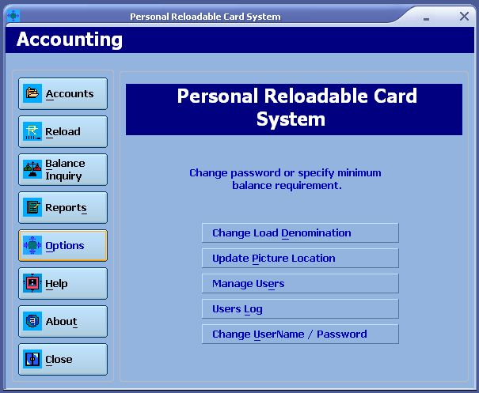



## Personal Reloadable Card System \(Complete\)

### Description

This is a complete point of sale program that uses reloadable card (which can be the user's ID) instead of cash. This program supports three terminals: Accounting (reloading and managing accounts), Bookstore and Canteen (actual sales transaction). You can also use a barcode scanner in inputting ID no of the account or itemcodes. The reports uses data dynamics reporting engine (now included in the zip file). This is my first submission. I hope someone can learn from this program. I'm also looking forward for your comments and suggestion to improve my programming skills. All of your votes and comments are highly appreciated. Please vote. Thank you.
 
### More Info
 

             |
---                |---
**Submitted On**   |2004-04-02 16:36:20
**By**             |[Mamerto Fabian Jr\.](https://github.com/Planet-Source-Code/PSCIndex/blob/master/ByAuthor/mamerto-fabian-jr.md)
**Level**          |Intermediate
**User Rating**    |4.8 (106 globes from 22 users)
**Compatibility**  |VB 6\.0
**Category**       |[Complete Applications](https://github.com/Planet-Source-Code/PSCIndex/blob/master/ByCategory/complete-applications__1-27.md)
**World**          |[Visual Basic](https://github.com/Planet-Source-Code/PSCIndex/blob/master/ByWorld/visual-basic.md)
**Archive File**   |[Personal\_R174086542004\.zip](https://github.com/Planet-Source-Code/mamerto-fabian-jr-personal-reloadable-card-system-complete__1-53551/archive/master.zip)

